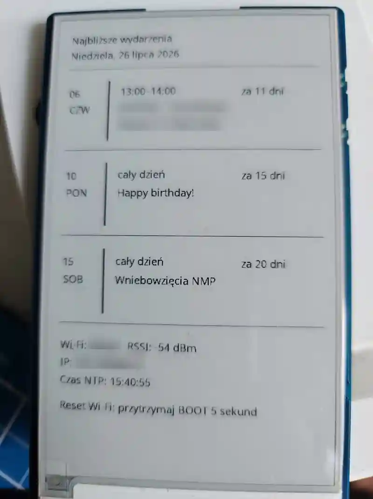
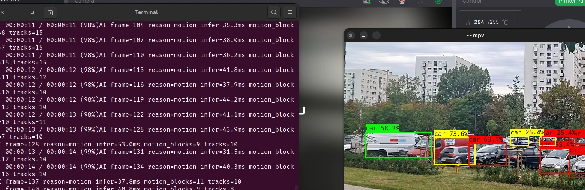
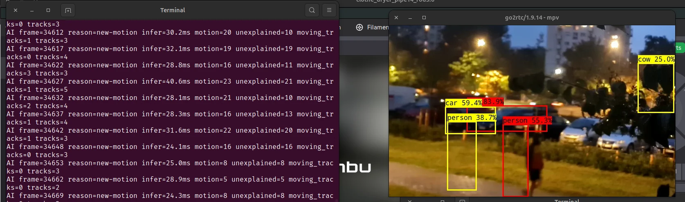

# Łukasz Budzynowski

**Technical Program Leader • AI Workflow Architecture & Agentic Systems • IT Governance • Digital Transformation**

Projektuję i prowadzę systemy od problemu do działającej produkcji — łącząc zarządzanie programami IT, architekturę rozwiązań, governance i bezpieczeństwo z praktycznym tworzeniem oprogramowania i automatyzacji.

Mam ponad 20 lat doświadczenia w pełnym cyklu życia systemów informatycznych: od analizy potrzeb, wymagań, dokumentacji i wyboru wykonawców, przez wdrożenia i odbiory, po utrzymanie, rozwój, ciągłość działania i nadzór nad środowiskami produkcyjnymi.

Równolegle buduję własne rozwiązania w Pythonie, Kotlinie, ESP-IDF i Bashu, pracuję z Linuxem, CI/CD, urządzeniami wbudowanymi i agentami AI. Projekty techniczne prowadzę w modelu GitHub-first: decyzja → kontrolowana implementacja → CI → przegląd → walidacja produkcyjna lub fizyczna.

**Warsaw, Poland · Polish · English C2**

## Open to opportunities

**Technical Program Leader · AI Adoption / Enablement · Head of IT · IT Programme Manager · System Owner**

Interesują mnie role łączące odpowiedzialność za systemy i produkty cyfrowe z transformacją organizacji, AI, governance, bezpieczeństwem i rzeczywistym dowożeniem rozwiązań.

Najlepiej odnajduję się tam, gdzie trzeba połączyć perspektywę biznesową, organizacyjną i techniczną — uporządkować problem, zaprojektować sposób działania, zorganizować wykonanie, doprowadzić rozwiązanie do produkcji i później świadomie nim zarządzać.

## What I do

- strategia IT, governance i transformacja cyfrowa;
- zarządzanie projektami, programami i pełnym cyklem życia systemów;
- wdrażanie AI oraz projektowanie kontrolowanej współpracy ludzi z agentami AI;
- zarządzanie zespołami, interesariuszami, dostawcami, ryzykiem i zmianą;
- wymagania, OPZ, kryteria wyboru wykonawców i dokumentacja zamówień publicznych;
- architektura, integracje, wdrożenia, utrzymanie i rozwój systemów;
- bezpieczeństwo, ciągłość działania, monitoring i przygotowanie operacyjne;
- Linux, Python, Bash, GTK, Kotlin, Android TV, ESP32 i automatyzacja;
- GitHub Actions, GitLab CI/CD, testy, proces wydawniczy i kontrolowane wdrożenia;
- NIS2/KSC, WCAG, UX oraz testowanie bezpieczeństwa aplikacji.

---

## Featured public software

### [Codex Usage Tray](https://github.com/lbudzynowski/codex-usage-tray)

Wskaźnik dla Ubuntu GNOME pokazujący wykorzystanie limitów OpenAI Codex i integrujący lokalne funkcje Codex z pulpitem Linux.

Najnowsze wydanie **v0.2.1** obejmuje aplikację Python/GTK, klienta `codex app-server`, Codex Remote Control, kontrolowane blokowanie uśpienia podczas aktywnego połączenia, testy jednostkowe, GitHub Actions i instalowalną paczkę `.deb`.

Aplikacja nie odczytuje plików uwierzytelniających ani tokenów — korzysta z mechanizmów logowania zarządzanych przez Codex. Krótkotrwałe dane parowania nie są utrwalane ani logowane.

[](https://github.com/lbudzynowski/codex-usage-tray/releases/latest)
[](https://github.com/lbudzynowski/codex-usage-tray/actions/workflows/tests.yml)
[](https://github.com/lbudzynowski/codex-usage-tray/blob/main/LICENSE)

### [Bhola Pulse](https://github.com/lbudzynowski/bhola-pulse)

Animowany dashboard telemetryczny dla Ubuntu GNOME na Wayland/XWayland.

Jeden długo działający proces w Pythonie zasila atomowy cache współdzielony przez instancje Conky. Projekt monitoruje między innymi CPU, RAM, temperatury, dyski, zasilanie, sieć, zaporę oraz lokalne usługi, zachowując celowo ograniczony i zredagowany zakres danych.

Dostępne są dwa niezależne style: graficzny **LARGE SHARP** oraz terminalowy **NERD MODE**. Wydanie obejmuje testowaną paczkę `.deb`, konfigurację zgodną z XDG, testy Python/Bash, kontrolę SHA-256, GitHub Actions oraz publikację przez Ubuntu PPA.

[](https://github.com/lbudzynowski/bhola-pulse/releases/latest)
[](https://github.com/lbudzynowski/bhola-pulse/actions/workflows/ci.yml)
[](https://github.com/lbudzynowski/bhola-pulse/blob/main/LICENSE)
[](https://launchpad.net/~lbudzynowski/+archive/ubuntu/apps)

```bash
sudo add-apt-repository ppa:lbudzynowski/apps
sudo apt update
sudo apt install bhola-pulse
```

<table>
  <tr>
    <td width="49%">
      <a href="https://github.com/lbudzynowski/bhola-pulse/blob/main/docs/images/large-sharp.png"></a><br>
      <sub><strong>LARGE SHARP</strong> — graphical telemetry dashboard.</sub>
    </td>
    <td width="49%">
      <a href="https://github.com/lbudzynowski/bhola-pulse/blob/main/docs/images/nerd-mode.png"></a><br>
      <sub><strong>NERD MODE</strong> — terminal/BBS-inspired view.</sub>
    </td>
  </tr>
</table>

---

## Selected product & engineering work

### Storytel TV Player

Nieoficjalny klient Android TV / Google TV do słuchania audiobooków Storytel, rozwijany i realnie testowany na Sony Bravia.

Aplikacja obsługuje prawdziwe konto i półkę użytkownika, sterowanie pilotem, natywne odtwarzanie przez AndroidX Media3 / ExoPlayer, przewijanie oraz dwukierunkową synchronizację pozycji ze Storytel.

Materiał sesji jest chroniony przez AES-256-GCM z kluczem w Android Keystore; cleartext HTTP i backup danych aplikacji są wyłączone. Projekt przeszedł utwardzanie bezpieczeństwa, Android lint, testy, GitHub Actions i proces stałego podpisywania wydań. Podpisana beta została fizycznie zainstalowana i zweryfikowana na Sony Bravia.

**Technologie:** Kotlin · Jetpack Compose for TV · Media3 / ExoPlayer · Android Keystore · GitHub Actions

### Dashboard kalendarza e-paper

Urządzenie oparte na ESP32-S3 i panelu e-paper 3,97″, zaprojektowane jako autonomiczny i energooszczędny dashboard Google Calendar.

Fizycznie zwalidowany prototyp obejmuje konfigurację Wi-Fi zapisywaną w NVS, synchronizację czasu NTP, pobieranie kalendarza przez HTTPS z weryfikacją certyfikatu, ograniczony kontrakt JSON, renderer UTF-8 z polskimi znakami oraz bezpieczne dwuslotowe OTA.

OTA sprawdza tożsamość projektu, wersję, rozmiar i SHA-256 obrazu, zapisuje aktualizację do nieaktywnego slotu i wykorzystuje rollback bootloadera w przypadku nieudanego uruchomienia.

<p align="center">
  <a href="assets/epaper-calendar-dashboard/live-calendar-battery-redacted.webp">
    
  </a>
</p>

[Pełna historia projektu i galeria sprzętu →](projects/epaper-calendar-dashboard.md)

### Note20 Edge Vision

Drugie życie Samsunga Galaxy Note20 Ultra 5G jako lokalnego węzła analizy obrazu AI. Stockowy Android zachował dostęp do kamery, ISP i kodeków, a ciężka ścieżka przetwarzania działała bezpośrednio na telefonie w Termuksie.

Finalny pipeline: kamera H.264 → go2rtc → FFmpeg → persistent ncnn / MobileNet-SSD → smart motion gating → sprzętowe kodowanie H.264 przez Android MediaCodec → wynikowy RTSP. Dla wybranego ROI system pracował przy **10 FPS**, a cache znanych obiektów ograniczał niepotrzebne ponowne wywołania AI dla nieruchomych scen.

W testach na rzeczywistym obrazie MobileNet-SSD rozpoznawał **ludzi, samochody i psa**, zarówno w dzień, jak i w nocy. Kolorowe ramki rozróżniały nowe lub niestabilne obiekty, rozpoznane obiekty nieruchome oraz ruch przecinający obszar znanej detekcji. Końcowy lag użytkowy został oceniony jako znikomy.

<table>
  <tr>
    <td width="49%">
      <a href="assets/note20-edge-vision/note20-edge-day.webp"></a><br>
      <sub><strong>Dzień</strong> — real-time detekcja i tracking na fizycznym Note20.</sub>
    </td>
    <td width="49%">
      <a href="assets/note20-edge-vision/note20-edge-cow.webp"></a><br>
      <sub><strong>Noc</strong> — przykład false positive: <code>cow 25.0%</code>.</sub>
    </td>
  </tr>
</table>

https://github.com/user-attachments/assets/7f4532e3-7486-43b1-8808-8ede7f5f9818

**Technologie:** Android · Termux · C++ · ncnn · MobileNet-SSD · FFmpeg · MediaCodec · go2rtc · RTSP

### QR-Audio

Eksperymentalny system przechowywania danych audio bezpośrednio w jednym lub wielu kodach QR — bez pobierania nagrania z Internetu podczas odtwarzania.

Androidowy klient wykorzystuje CameraX i lokalny model ML Kit do skanowania wielu części w dowolnej kolejności. Dane są składane, weryfikowane przez CRC32 i odtwarzane lokalnie.

Projekt rozwinął własny format QRA1, generator kodów, protokół binarny, składanie wieloczęściowych danych oraz obsługę skanowania i odtwarzania binarnego QRA1.

**Technologie:** Android · CameraX · ML Kit · protokół binarny · CRC32 · działanie offline

### Yeti Smart Tag

System identyfikatorów NFC dla psów połączonych z mobilnym profilem kontaktowym.

Projekt obejmuje fizyczny NTAG213, modele OpenSCAD i druk 3D, responsywny profil internetowy, generator wielu profili, prywatny lokalny CRM w Pythonie/SQLite oraz kontrolowany proces publikacyjny z walidacją danych.

Profil może — po świadomym użyciu funkcji **„Udostępnij lokalizację”** — pobrać położenie telefonu, pozwolić wybrać opiekuna i uruchomić ścieżkę powiadomienia SMS z lokalizacją znalazcy. Przepływ został sprawdzony na rzeczywistym telefonie: SMS dotarł po użyciu tej funkcji; samo otwarcie profilu nie wysyła wiadomości.

Równolegle testujemy rozwiązanie taga wykorzystujące wiadomości SMS jako dodatkowy kanał powiadomień.

Architektura rozdziela publiczny kod, szablony i dane demonstracyjne od rzeczywistych danych właścicieli i zwierząt. Projekt służy również jako praktyczne laboratorium prywatności, bezpiecznych wdrożeń i integracji usług.

---

## Jak pracuję z AI

Nie traktuję AI jako generatora kodu działającego bez nadzoru. Projektuję cały proces współpracy człowieka z agentami: rozdzielam planowanie, decyzje, wykonanie i walidację, a autonomię ograniczam do jasno określonych granic.

W praktyce oznacza to GitHub jako źródło prawdy dla kodu, małe i odwracalne zmiany, CI, przegląd różnic, walidację dokładnego SHA, izolowane środowiska wykonawcze i jawne bramki przed operacjami produkcyjnymi, destrukcyjnymi lub wywołującymi efekt fizyczny.

### Continuity Bridge i pełne archiwum rozmów

Continuity Bridge jest prywatnym systemem utrzymywania długotrwałej ciągłości pracy człowieka z AI. Rozdziela pamięć kuratorską od pełnych archiwów źródłowych i pozwala przenosić stan wielu projektów między kolejnymi rozmowami bez kopiowania wszystkiego do jednego promptu.

Bieżąca metoda pełnej archiwizacji **nie opiera się na DOM-ie**. Pełna widoczna gałąź rozmowy jest zamieniana na kanoniczny `conversation.json`; oryginalne pliki trafiają do osobnych katalogów assetów. Pakiet otrzymuje manifest SHA-256 i ZIP, jest zapisywany na Google Drive, odczytywany ponownie i weryfikowany pod kątem sum kontrolnych oraz integralności. Końcowy stan jest zamykany terminalnym sealem, tak aby późniejszy komunikat nie zmienił zawartości już uznanego za kompletne archiwum.

### Muza / MUSE-01

Modułowy projekt osobistej asystentki AI: obecnie aplikacja desktopowa dla Ubuntu, docelowo również niewielki fizyczny robot drukowany w 3D.

Działający prototyp Muza Desktop wykorzystuje Python, GTK 4 i przenośny rdzeń aplikacji. Integracje z API, mikrofonem, kamerą i audio nie są jeszcze deklarowane jako działające funkcje tego prototypu.

Dla projektu działa również odizolowany self-hosted runner na miniPC: wykonuje testy Python/GTK i kontrolę granic środowiska bez dostępu do niepotrzebnych zasobów hosta. Projekt świadomie rozdziela publiczny kod od prywatnych danych i zasobów.

---

## Governance & Digital Transformation

### NIS2 / KSC programme

Projekt przygotowania organizacji do wymagań NIS2/KSC prowadzony jako pełny program transformacyjny, a nie pojedynczy audyt zgodności.

Zakres obejmuje analizę podstaw prawnych i luk, governance i RACI, strukturę programu, rejestry ryzyka, aktywów i dowodów, plan zespołu i odpowiedzialności, budżet, harmonogram, przygotowanie operacyjne oraz procesy obsługi incydentów i wymaganych kanałów współpracy.

Szczegóły organizacyjne i materiały robocze pozostają prywatne.

### IT Systems — Case Studies

W swojej pracy zawodowej przygotowywałem założenia, wymagania i dokumentację systemów informatycznych, prowadziłem wybór i nadzór wykonawców, odbiory, wdrożenia, rozwój oraz utrzymanie środowisk produkcyjnych.

Pracowałem między innymi przy:

- Zintegrowanym Rejestrze Kwalifikacji — ZRK;
- systemie Ekonomicznych Losów Absolwentów — ELA;
- rozwiązaniach Zintegrowanego Systemu Kwalifikacji — ZSK;
- wdrożeniu i utrzymaniu EZD RP;
- systemach webowych, integracjach, chmurze i automatyzacji procesów operacyjnych.

---

## Upstream contributions

Poza własnymi repozytoriami zgłaszam odtwarzalne błędy, regresje, problemy dokumentacyjne i propozycje funkcji bezpośrednio do projektów, których używam.

- **Chromium**
  - [#556290470 — Chrome Canary touchpad scrolling regression](https://issues.chromium.org/issues/556290470) — problem odizolowany do stanu profilu/Variations i zgłoszony wraz z reprodukcją, obejściem oraz powiązaniem z istniejącym zgłoszeniem Chromium i odpowiadającą mu zmianą w kodzie.

- **OpenAI / Codex**
  - [#38863 — Codex Desktop on Linux defaults spellcheck to en-US and flags Polish text as misspelled](https://github.com/openai/codex/issues/38863)
  - [#35928 — Remote Connections docs contradict the new `codex remote-control pair` CLI workflow](https://github.com/openai/codex/issues/35928)

- **PrintStash**
  - [#70 — Preserve the exact printed artifact/revision and slicer settings for Bambu external print jobs](https://github.com/xiao-villamor/PrintStash/issues/70)
  - [#69 — Bambu LAN on Bambu A1 fails with Paho v2 callbacks, PUBACK handling, cleanup order, and partial MQTT reports](https://github.com/xiao-villamor/PrintStash/issues/69)

<details>
<summary>Historical upstream reports</summary>

- **CopyQ**
  - [#1240 — No history after upgrade to Ubuntu 19.10](https://github.com/hluk/CopyQ/issues/1240)

- **WiFi Signal Strength GNOME extension**
  - [#2 — Error](https://github.com/Tomin1/wifisignalstrength/issues/2)

</details>

---

## Other projects

<details>
<summary>Additional software, automation and infrastructure work</summary>

### Repo Security Scanner

Prywatny, centralny system audytu bezpieczeństwa repozytoriów. Obecny `main` obejmuje rzeczywisty pilot Gitleaks w modelu tylko do odczytu oraz kontrolę bezpieczeństwa zdalnych wdrożeń. Szerszy zestaw skanerów i uniwersalna bramka bezpieczeństwa wydań są rozwijane osobnymi zmianami i nie są przedstawiane jako ukończone funkcje.

### Put.io Skip Intro TV

Android TV / Google TV application for Sony Bravia with put.io pairing, Android Keystore token storage, subtitle playback and user-defined intro markers.

### Leki 2.0

Private household inventory application combining Google Sheets / Apps Script, a mobile interface and a local Ubuntu barcode scanner with an append-only movement ledger, stock calculations and inventory reconciliation.

### Bambu / Spoolman / PrintStash

Private 3D-printing infrastructure covering physical filament inventory, Bambu Lab A1 / AMS Lite, Spoolman, automatic consumption tracking, PrintStash and controlled diagnostics of printer communication.

### Ubuntu Desktop Tools

Python/GTK utilities for VPN, firewall and service state, system monitoring, web integrations, local automation and mobile notifications.

### Home infrastructure

Mini-PC based environment with Linux, containers, local reverse proxying, monitoring, Home Assistant and controlled GitHub-first infrastructure automation.

</details>

---

## Technology

`Python` · `Bash` · `Linux` · `Ubuntu` · `GTK 3/4` · `Git` · `GitHub Actions` · `GitLab CI/CD` · `Docker` · `systemd` · `Redmine` · `FastAPI` · `Google Apps Script` · `Kotlin` · `Android TV` · `Jetpack Compose` · `ESP-IDF` · `ESP32-S3` · `OpenSCAD`

**Praktyki inżynierskie:** CI/CD · proces wydawniczy · przegląd kodu · modelowanie zagrożeń · śledzenie pochodzenia artefaktów przez SHA-256 · fail-closed · minimalne uprawnienia · testy automatyczne · walidacja sprzętowa · niezależny odczyt kontrolny po wdrożeniu

## Contact

Warsaw, Poland  
[E-mail](mailto:lbudzynowski@gmail.com)

## Support open-source work

[GitHub Sponsors](https://github.com/sponsors/lbudzynowski) · [PayPal](https://paypal.me/lbudzynowski)