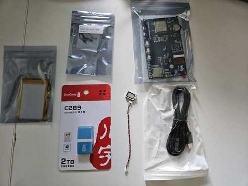

# ESP32-S3 E-Paper Calendar Dashboard

## From hardware bring-up to secure wireless updates

What began as a search for a compact, low-power Google Calendar display evolved into a physically validated embedded baseline built around a Waveshare ESP32-S3 development board and a 3.97-inch, 800 × 480 e-paper panel.

The original goal was deliberately practical: create an always-visible agenda for a refrigerator or desk, with excellent readability, very low standby power and no continuously illuminated screen. During development, the project grew into a broader embedded platform with Wi-Fi provisioning, live calendar data, Polish text rendering, battery monitoring, hardware diagnostics and rollback-protected firmware updates.

> **Physically validated baseline:** Wi-Fi provisioning, NTP synchronization, live Google Calendar data over certificate-verified HTTPS, bounded JSON parsing, UTF-8 rendering with Polish characters, dual-slot OTA, candidate-image validation and automatic rollback.
>
> **Current development:** stacked draft branches add persistent, physically initiated wireless OTA authorization, a battery and USB charging indicator, a dual-screen calendar and diagnostics interface, and a dedicated upcoming-appointments section. Automated tests and clean firmware builds have passed; the complete integrated workflow still requires hardware validation.


*A live calendar view on the physical prototype. Only selected appointment and network details were redacted before publication.*

## 1. Selecting the platform

The first design decision was whether to use a smaller all-in-one 400 × 300 module or a higher-resolution board with enough room for a genuinely readable agenda. The final choice was the Waveshare ESP32-S3 3.97-inch e-paper board because it offered:

- an 800 × 480 monochrome panel;
- an ESP32-S3 with 16 MB flash and 8 MB PSRAM;
- USB-C and battery support;
- an AXP2101 power-management IC;
- physical controls, RTC, microSD and onboard environmental sensing;
- enough screen area for a portrait-oriented agenda without reducing text to an unreadable size.



*The hardware package before the first custom firmware was flashed.*

Before changing anything, the complete 16 MB factory flash was backed up and verified byte-for-byte. A known-good recovery build was also retained locally. This made experimentation reversible from the beginning.

## 2. Hardware bring-up and capability probing

The board arrived with a factory demonstration application. It confirmed that the display, controls and basic peripherals were functional, but the final product required a clean ESP-IDF firmware and an independently verified understanding of the hardware.

A dedicated hardware-probe application was created to validate the board feature by feature. It covered power management, screen orientation, full and partial refresh, controls, virtual pages, audio paths and other board capabilities. This prevented product code from being built on assumptions copied from examples or vendor documentation.

The probe exposed several integration details that only became obvious on the real device:

- the e-paper power rail had to be enabled through the AXP2101;
- the panel required a portrait-specific rotation and coordinate mapping;
- the vendor text API used foreground and background arguments in a surprising order;
- partial-refresh regions required careful transformation;
- physical button handling needed debouncing and explicit event semantics.

The hardware probe was treated as a validation tool rather than throwaway code. Each capability was first demonstrated independently, then incorporated into the product firmware only after the physical result was understood.

## 3. Polish text rendering

Polish calendar data made UTF-8 support a product requirement rather than a cosmetic improvement. The vendor fonts did not provide a reliable path for every required character, so the firmware received bounded UTF-8 handling and embedded glyph support.

The first attempts produced visibly corrupted diacritics. Instead of hiding the defect, the project introduced a repeatable glyph-validation screen and used it to isolate rendering, bit-order and coordinate problems. The resulting renderer preserves UTF-8 boundaries and displays lowercase and uppercase Polish characters without external font files.


*An early corrupted renderer on the left and the validated glyph layout on the right.*

This work later became part of the normal calendar renderer, including date labels, event titles, locations and system messages.

## 4. From a static layout to live Google Calendar data

The first calendar screen used a controlled local fixture. That allowed the visual hierarchy, field limits and text rendering to be validated before networking was introduced.

The live data path was then built as a deliberately narrow pipeline:

```text
Google Calendar
    → Google Apps Script
    → versioned JSON contract
    → certificate-verified HTTPS
    → ESP32 parser and renderer
    → e-paper display
```

The Apps Script service reads a limited future window, sorts the events and returns only the fields required by the display. The schema includes generation time, timezone, date labels and a bounded list of events. Text is truncated at valid UTF-8 boundaries to match fixed firmware buffers.

The ESP32 stores Wi-Fi configuration in NVS, synchronizes time through NTP and fetches the feed only after time is valid enough for TLS certificate checks. The feed URL and access token remain outside the repository and are not printed in logs.

The device also provides a physical recovery path: after a normal startup, holding the BOOT control for five seconds clears saved Wi-Fi configuration and returns the board to provisioning mode.

## 5. Problems found only on real hardware

The live integration exposed failures that unit tests and a desktop HTTP client did not reproduce.

### Google Apps Script redirects

Google Apps Script returned an HTTP 302 response whose body used chunked transfer encoding. The first implementation relied on automatic redirect handling, but ESP-IDF reported an incomplete response before performing the second request.

The final implementation performs the redirect in two controlled stages: it validates the `Location` header, closes the first response without trying to consume the chunked body, and then performs a second certificate-verified HTTPS request to an explicitly allowed Google host.

### Stack pressure

Large URL buffers initially lived on the main task stack. They were moved to the heap and released on every exit path, eliminating stack exhaustion without masking the problem by simply increasing the task stack.

### Time synchronization

A short custom wait loop could stop SNTP before a valid time was obtained. It was replaced with the ESP-IDF synchronization API, a longer bounded timeout and explicit diagnostic logs.

These corrections were validated on the physical board, not only in CI.

## 6. Secure and recoverable OTA updates

Once the live calendar was stable, the firmware moved from a factory-only partition layout to two 7 MiB application slots with OTA metadata and bootloader rollback enabled.

The update process is intentionally defensive:

1. Fetch a manifest over certificate-verified HTTPS.
2. Require HTTP 200 and an exact content length.
3. Validate the declared version, image URL, size and SHA-256.
4. Stream the candidate image into the inactive slot.
5. Check the image header, project identity and embedded version.
6. Compare the streamed SHA-256 before changing the boot partition.
7. Boot the candidate as a trial image.
8. Mark it valid only after the board, display, Wi-Fi, NTP, calendar feed and local OTA service initialize successfully.
9. Roll back automatically when the candidate does not reach the confirmation point.

The implementation was exercised with normal and negative hardware tests, including:

- a successful update between slots;
- an interrupted transfer;
- an incorrect SHA-256;
- the same version as the running firmware;
- a manifest version that did not match the image;
- an image built for a different project;
- a deliberately non-confirmed candidate followed by automatic rollback.

In every rejection case, the currently valid application remained selected and operational.

## 7. Current development stage

The validated baseline is being extended through a stack of draft development branches. Each layer preserves the previous work while adding one independently testable capability.

### Persistent, physically initiated wireless OTA authorization

The original local OTA endpoint generated a new bearer token on every boot and exposed it through the serial monitor. The network transfer was wireless, but obtaining the token still required USB.

The draft implementation replaces that flow with a persistent 256-bit secret stored in a dedicated NVS namespace. The device must boot normally; BOOT must never be held during power-on or reset because GPIO0 is a strapping pin. After startup, holding BOOT for approximately two to three seconds and releasing it before five seconds opens a 120-second provisioning window. Holding it for five seconds remains exclusively the Wi-Fi credential reset gesture.

During the physical window, `POST /ota/provision` stores the workstation-generated secret. Subsequent updates use authenticated `POST /ota` requests, while `GET /ota/status` exposes only non-sensitive state and the firmware version. After the one-time migration and pairing procedure, later firmware updates can be initiated over Wi-Fi without serial access, `esptool` or a USB cable.

Authorization currently travels over local HTTP, while manifests and firmware images use certificate-verified HTTPS. The workflow is therefore intended for a trusted or isolated LAN; application-layer challenge-response or local TLS remains a possible future hardening step.

### Battery status, dual-screen diagnostics and appointments

The integrated draft adds a phone-style battery indicator with proportional fill, percentage text and an independent USB charging symbol. It uses AXP2101 readings and includes host tests for boundary and invalid values.

The user interface consists of two full-screen views. The calendar screen retains the normal agenda and adds an upcoming-appointments section sourced from an optional, backward-compatible `appointments` field in the feed. The second screen is reserved for diagnostics such as Wi-Fi state, RSSI, IP address, NTP synchronization, firmware version, OTA state and calendar-fetch information.

The official board-support-package wheel events for both Up and Down are implemented as navigation inputs with independent debouncing. Returning to the calendar triggers a fresh feed request while preserving the last valid data if the refresh fails. BOOT and Function are intentionally excluded from screen navigation.

### Validation status

The draft stack has passed host tests, Apps Script feed tests, source validation, formatting checks and clean ESP-IDF 5.5.5 builds. Build success is recorded separately from hardware success.

The integrated work is not yet part of the physically validated baseline. Remaining end-to-end checks include installing the migration firmware on the target board, physically provisioning the OTA secret, completing an authenticated wireless update, observing `/ota/status` through reboot, validating the live appointments feed, confirming both wheel directions on the device, checking battery and USB states, and repeating rollback verification on the integrated image.

## Engineering approach

This project follows a few consistent rules:

- GitHub and exact commit identifiers are the source of truth.
- A firmware image is not flashed until its exact revision has passed formatting, host tests and ESP-IDF builds.
- Hardware validation is recorded separately from CI success.
- Secrets, private feed URLs, Wi-Fi credentials and recovery images remain outside the repository.
- Potentially destructive changes begin with a verified flash backup and a recovery path.
- Negative tests are treated as product requirements, not optional cleanup.

## Technology

`ESP32-S3` · `ESP-IDF 5.5.5` · `C` · `FreeRTOS` · `e-paper 800 × 480` · `AXP2101` · `NVS` · `SNTP` · `HTTPS/TLS` · `Google Apps Script` · `Google Calendar` · `JSON` · `SHA-256` · `dual-slot OTA` · `rollback` · `GitHub Actions`

## Privacy and repository scope

The product repository is private. This public case study intentionally contains no Wi-Fi credentials, calendar-feed token, OTA secret, private server path, recovery image or personal calendar information. Photographs containing appointment or network details were cropped or redacted before publication.
